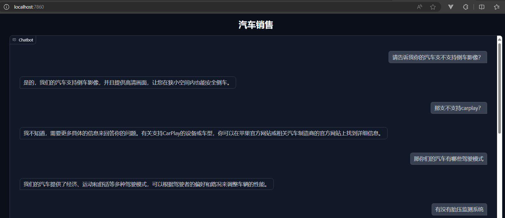

## homework4: sales chatbot的扩展使用

### 1：使用chatGPT引导生成多份航运客服的对话话术，并保存到test_qa.txt文件；
### 2：在car_sales.ipynb文件中读取test_qa.txt的内容，用向量数据库Faiss持久化这些问答信息；
### 3：在car_sales_chatbot.py文件中，初始化汽车销售问答机器人并启动Gradio 服务
### 4：当向量数据库中没有合适答案时，使用大语言模型能力LLM+prompt提示词来回答客户问题，而不是直接告诉用户我是一个AI机器人
### 5：测试效果图
